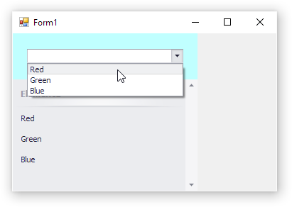

<!-- default badges list -->

[](https://supportcenter.devexpress.com/ticket/details/T830506)
[](https://docs.devexpress.com/GeneralInformation/403183)
<!-- default badges end -->
# WinForms Accordion Control - Custom filter UI

This example creates a custom filter control and assigns it to the [AccordionControl.FilterControl](https://documentation.devexpress.com/WindowsForms/DevExpress.XtraBars.Navigation.AccordionControl.FilterControl.property) property to filter accordion items:

```csharp
this.accordionControl1.FilterControl = this.customFilterControl1;
```




## Files to Review

* [CustomFilterControl.cs](./CS/WindowsFormsApp7/CustomFilterControl.cs) (VB: [CustomFilterControl.vb](./VB/WindowsFormsApp7/CustomFilterControl.vb))
